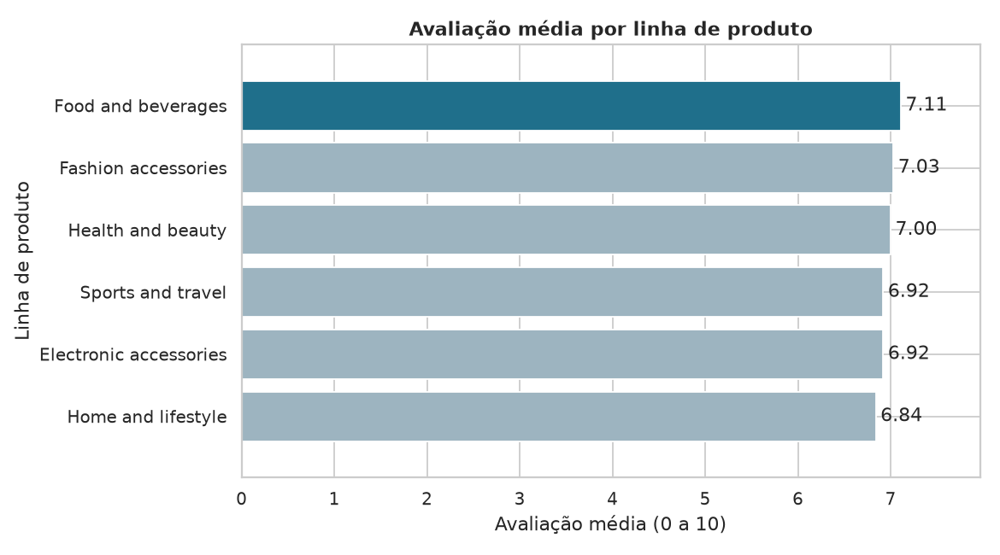
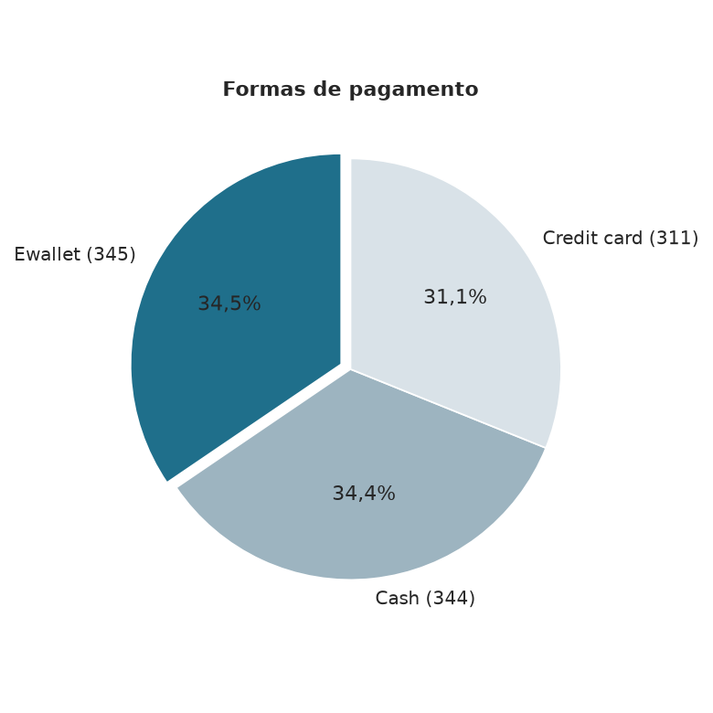
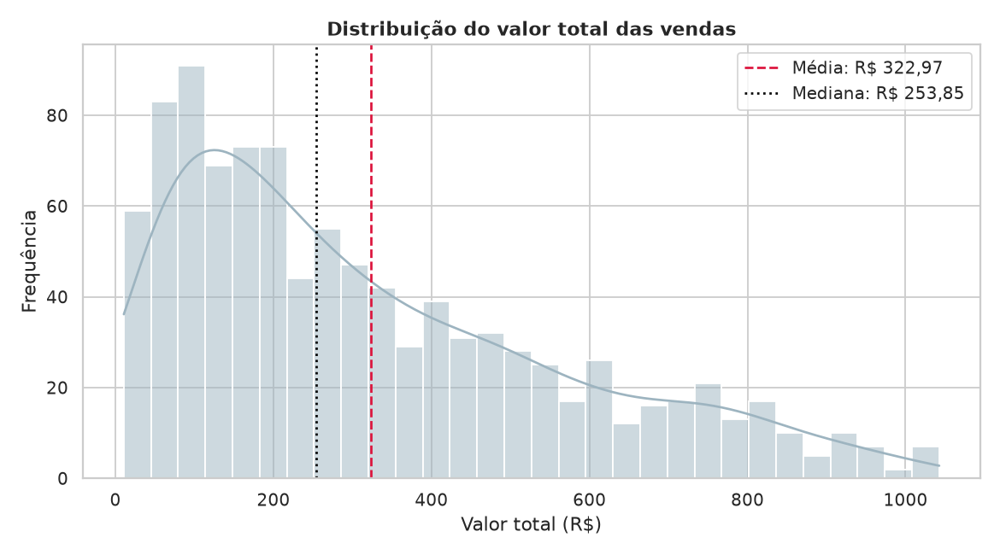
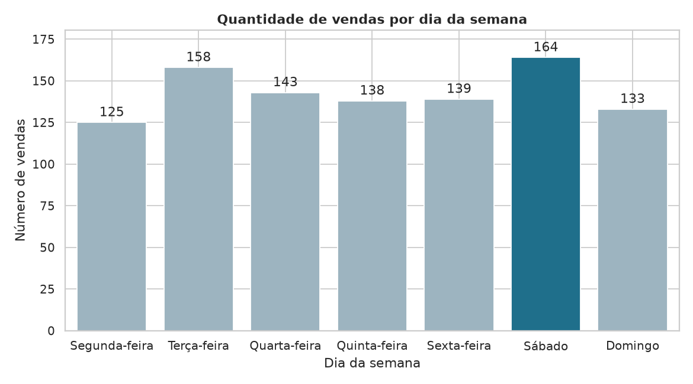

# Respostas às perguntas de negócio

## 1. Qual filial apresentou o maior faturamento?

**Hipótese:** A filial com mais vendas (transações) também é a de maior faturamento.

**Resposta:** Giza, com R$ 110.568,71 (34,2% do total).

**Evidência:** Giza: R$ 110.568,71; Alex: R$ 106.200,37; Cairo: R$ 106.197,74

**Validação da hipótese:** Refutada — a filial com mais vendas é Alex.

## 2. Qual filial realizou a maior quantidade de vendas?

**Hipótese:** O volume de vendas é equilibrado entre as filiais (diferença entre maior e menor inferior a 10%).

**Resposta:** Alex, com 340 vendas.

**Evidência:** Alex: 340; Cairo: 332; Giza: 328

**Validação da hipótese:** Confirmada — diferença entre maior e menor de 3,5%.

## 3. Qual linha de produto apresentou o maior faturamento?

**Hipótese:** A linha líder em faturamento também é a líder em unidades vendidas.

**Resposta:** Food and beverages, com R$ 56.144,86.

**Evidência:** Food and beverages: R$ 56.144,86; Sports and travel: R$ 55.122,88; Electronic accessories: R$ 54.337,52; Fashion accessories: R$ 54.305,88; Home and lifestyle: R$ 53.861,87; Health and beauty: R$ 49.193,81

**Validação da hipótese:** Refutada — a líder em unidades é Electronic accessories.

## 4. Qual linha de produto recebeu a melhor avaliação média?

**Hipótese:** As avaliações médias são homogêneas entre as linhas (amplitude inferior a 0,5 ponto).

**Resposta:** Food and beverages, com média 7.11.

**Evidência:** Food and beverages: 7.11; Fashion accessories: 7.03; Health and beauty: 7.00; Electronic accessories: 6.92; Sports and travel: 6.92; Home and lifestyle: 6.84

**Validação da hipótese:** Confirmada — amplitude de 0.28 ponto(s).

## 5. Qual foi a forma de pagamento mais utilizada?

**Hipótese:** Nenhuma forma de pagamento concentra mais da metade das vendas.

**Resposta:** Ewallet, com 345 vendas (34,5%).

**Evidência:** Ewallet: 34,5%; Cash: 34,4%; Credit card: 31,1%

**Validação da hipótese:** Confirmada — a líder detém 34,5%.

## 6. Qual foi o valor médio das vendas?

**Hipótese:** A média é maior que a mediana (distribuição assimétrica à direita).

**Resposta:** R$ 322,97 por venda.

**Evidência:** média R$ 322,97; mediana R$ 253,85; desvio padrão R$ 245,89.

**Validação da hipótese:** Confirmada — média > mediana.

## 7. Qual foi a maior venda registrada?

**Hipótese:** A maior venda é um outlier estatístico (acima de Q3 + 1,5 × IQR).

**Resposta:** R$ 1.042,65 (venda 860-79-0874, filial Giza, linha Fashion accessories).

**Evidência:** limite superior de outliers: R$ 991,74.

**Validação da hipótese:** Confirmada — a maior venda excede o limite.

## 8. Em qual dia da semana ocorreu a maior quantidade de vendas?

**Hipótese:** O fim de semana concentra mais vendas do que o esperado (2/7 = 28,6% do total).

**Resposta:** Sábado, com 164 vendas.

**Evidência:** Segunda-feira: 125; Terça-feira: 158; Quarta-feira: 143; Quinta-feira: 138; Sexta-feira: 139; Sábado: 164; Domingo: 133

**Validação da hipótese:** Confirmada — sábado e domingo somam 29,7% das vendas.

