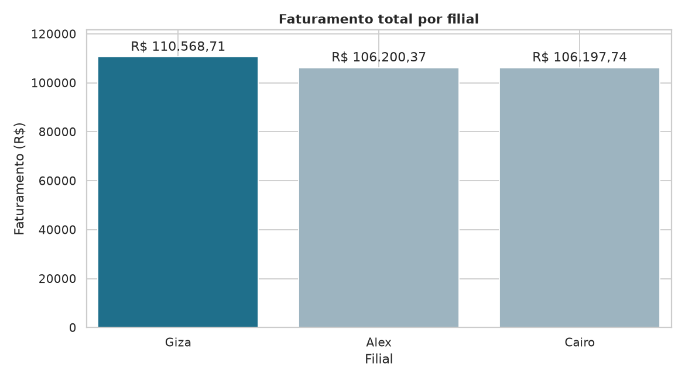
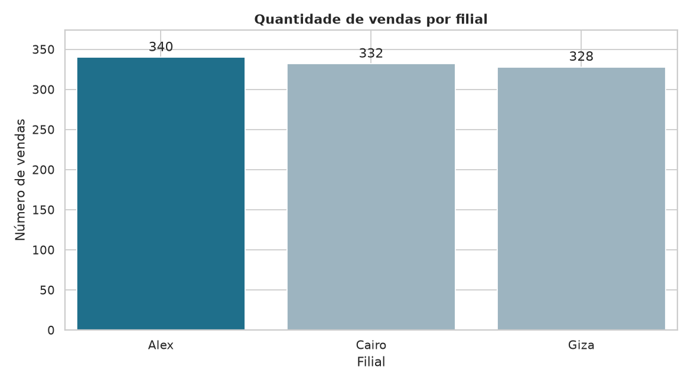
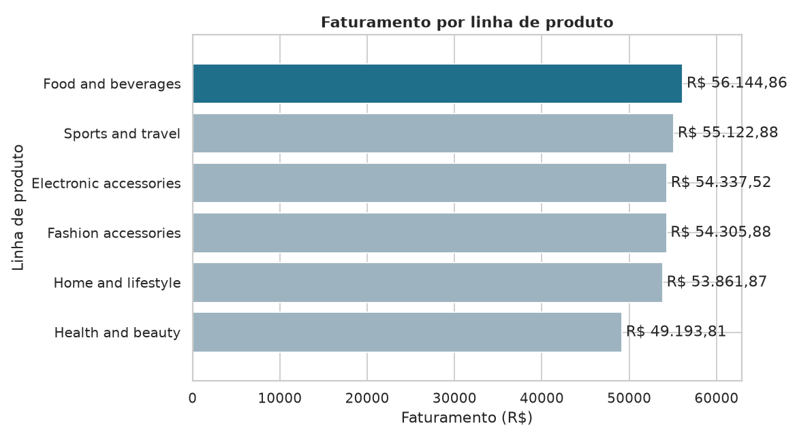
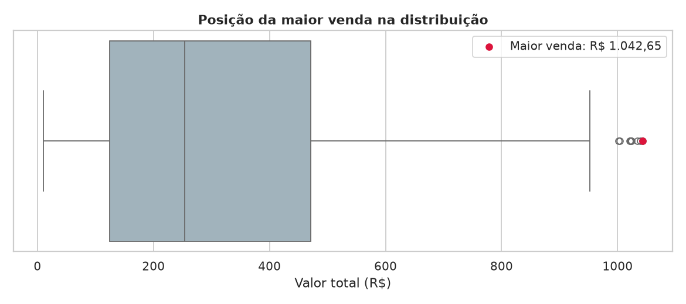

# Pipeline de Vendas de Supermercado (PostgreSQL + Python)

Projeto avaliativo do Módulo 1. Uma rede de supermercados precisa organizar
os registros de vendas de suas filiais e responder perguntas de negócio. O
pipeline baixa os dados brutos, armazena no PostgreSQL, consulta e exporta
via SQL, trata no Pandas e gera estatísticas e gráficos.

**Fonte dos dados:** [Supermarket Sales Dataset (Kaggle)](https://www.kaggle.com/datasets/faresashraf1001/supermarket-sales) — 1000 vendas, 17 colunas.

## Tecnologias

| Tecnologia            | Uso                                           |
| --------------------- | --------------------------------------------- |
| Python 3.10+          | Linguagem do pipeline                         |
| PostgreSQL            | Armazenamento (camadas Raw e Tratada)         |
| Pandas / NumPy        | Leitura, limpeza, tipagem e colunas derivadas |
| SQLAlchemy + psycopg2 | Conexão com o PostgreSQL                     |
| Matplotlib / Seaborn  | Gráficos                                     |
| python-dotenv         | Credenciais fora do código (`.env`)        |

## Estrutura do projeto

```
├── sql/
│   ├── 01_criar_banco.sql        # CREATE DATABASE
│   ├── 02_criar_tabelas.sql      # raw_vendas e vendas_tratadas (PK, NOT NULL, CHECK)
│   └── 03_consultas.sql          # consultas + marcadores de exportação para CSV
├── src/
│   ├── config.py                 # caminhos, credenciais (.env) e engines
│   ├── setup_db.py               # Fase 0: executa os scripts SQL 01 e 02
│   ├── carga_raw.py              # Fase 1: CSV -> raw_vendas (sem alterar conteúdo)
│   ├── exportacao.py             # Fase 2: executa 03_consultas.sql e exporta CSVs
│   ├── 01_leitura_dados.py       # Leitura e inspeção inicial (EDA) no Pandas
│   ├── 02_etl_vendas.py          # Fase 3: limpeza, tipagem, nulos, derivadas
│   ├── 03_estatistica.py         # Fase 4: estatísticas, hipóteses e gráficos
│   ├── dicionario.py             # gera o dicionário de dados
│   └── run_etl.py                # executa todas as fases em sequência
├── data/
│   ├── raw/                      # CSV original + CSVs exportados do PostgreSQL
│   └── processed/                # vendas_tratadas.csv + dicionario_dados.csv/.md
├── resultados/                   # estatísticas, respostas e graficos/
├── projeto.ipynb                 # notebook com todo o fluxo, passo a passo
├── requirements.txt
└── .gitignore
```

## Arquitetura em camadas

Obs: Aqui os locais podem mudar de usuário para usuário.

| Camada     | O que é                                                                        | Onde fica                                                          |
| ---------- | ------------------------------------------------------------------------------- | ------------------------------------------------------------------ |
| Raw        | Cópia fiel do CSV (campos`TEXT`), com `data_carga` para rastreabilidade    | tabela`raw_vendas` e `data/raw/`                               |
| Tratada    | Dados limpos, tipados (`NUMERIC`, `DATE`, `TIME`) e com colunas derivadas | tabela`vendas_tratadas` e `data/processed/vendas_tratadas.csv` |
| Resultados | Métricas, estatísticas descritivas e gráficos                                | `resultados/`                                                    |

## Como executar

**Pré-requisitos:** Python 3.10+ e PostgreSQL em execução.

```bash
# 1. Clonar e entrar na pasta
git clone <url-do-repositorio>
cd <pasta-do-repositorio>

# 2. Ambiente virtual e dependências
python -m venv .venv
source .venv/bin/activate        # Windows: .venv\Scripts\activate
pip install -r requirements.txt

# 3. Credenciais (o .env não é versionado)
cp .env.example .env             # edite DB_USER e DB_PASSWORD

# 4. Dados: baixe o CSV no Kaggle e salve como
#    data/raw/SuperMarket Analysis.csv

# 5. Executar todo o pipeline
python src/run_etl.py
```

O notebook `projeto.ipynb` executa o mesmo fluxo célula a célula (útil para
explorar e demonstrar). Cada etapa também roda isolada, por exemplo `python src/02_etl_vendas.py`.
Os scripts SQL podem ser executados manualmente com
`psql -U postgres -f sql/01_criar_banco.sql` e
`psql -U postgres -d supermercado -f sql/02_criar_tabelas.sql`.

## Fases do pipeline

| Fase | Script                                  | O que faz                                                                                                        |
| ---- | --------------------------------------- | ---------------------------------------------------------------------------------------------------------------- |
| 0    | `sql/01`, `sql/02`, `setup_db.py` | Cria o banco e as tabelas com PK,`NOT NULL` e `CHECK`                                                        |
| 1    | `carga_raw.py`                        | Carrega o CSV em`raw_vendas` sem alterar o conteúdo (transação `TRUNCATE` + `INSERT`)                   |
| 2    | `sql/03`, `exportacao.py`           | Consultas com`SELECT`, `WHERE`, `GROUP BY`, `SUM`, `AVG`, subconsulta; exporta CSVs para `data/raw/` |
| 2/3  | `01_leitura_dados.py`                 | Lê o CSV exportado no Pandas: tipos, nulos, duplicidades, inconsistências e estatísticas                      |
| 3    | `02_etl_vendas.py`                    | Casting, tratamento de nulos, duplicidades, regras de negócio e colunas derivadas                               |
| 4    | `03_estatistica.py`                   | Hipóteses, estatística descritiva e gráficos para as 8 perguntas                                              |

### Tratamentos aplicados na Fase 3

- Remoção de espaços extras e conversão de vazios em nulo.
- Casting: numéricos (`NUMERIC`), `Quantidade` inteira, `data_venda` (formato `m/d/Y`) e `hora_venda`.
- Nulos: campos opcionais recebem "Não informado"; linhas com nulo em campo obrigatório são removidas.
- Duplicidades: linhas idênticas e IDs de venda repetidos.
- Casos limítrofes: preço/imposto/valor negativo, quantidade ≤ 0 e avaliação fora de 0–10 são descartados e contados no log.
- Colunas derivadas: `dia_semana`, `mes`, `periodo_dia` e `valor_conferido` (confere `Quantidade × preco_unitario + Imposto = valor_total`).

## Dicionário de dados (camada tratada)

Também gerado em `data/processed/dicionario_dados.csv` e `.md`.

| coluna            | tipo          | restricoes            | descricao                                                                     | origem                       |
| ----------------- | ------------- | --------------------- | ----------------------------------------------------------------------------- | ---------------------------- |
| id_venda          | VARCHAR(50)   | PRIMARY KEY, NOT NULL | Identificador unico da venda (Invoice ID)                                     | raw: invoice_id              |
| Filial            | VARCHAR(10)   | NOT NULL              | Codigo da filial                                                              | raw: branch                  |
| Cidade            | VARCHAR(100)  | NOT NULL              | Cidade da filial                                                              | raw: city                    |
| tipo_cliente      | VARCHAR(50)   | -                     | Member ou Normal                                                              | raw: customer_type           |
| Gênero           | VARCHAR(20)   | -                     | Genero do cliente                                                             | raw: gender                  |
| linha_produto     | VARCHAR(150)  | NOT NULL              | Categoria do produto                                                          | raw: product_line            |
| preco_unitario    | NUMERIC(10,2) | NOT NULL, CHECK >= 0  | Preco por unidade                                                             | raw: unit_price              |
| Quantidade        | INTEGER       | NOT NULL, CHECK > 0   | Unidades vendidas                                                             | raw: quantity                |
| Imposto           | NUMERIC(10,2) | CHECK >= 0            | Imposto de 5 por cento sobre o custo                                          | raw: tax_5pct                |
| valor_total       | NUMERIC(12,2) | NOT NULL, CHECK >= 0  | Valor total da venda (custo + imposto)                                        | raw: sales                   |
| data_venda        | DATE          | NOT NULL              | Data da venda (texto m/d/Y convertido para data)                              | raw: date                    |
| hora_venda        | TIME          | -                     | Horario da venda (texto convertido para hora)                                 | raw: time                    |
| forma_pagamento   | VARCHAR(50)   | NOT NULL              | Cash, Ewallet ou Credit card                                                  | raw: payment                 |
| custo_mercadoria  | NUMERIC(12,2) | CHECK >= 0            | Custo da mercadoria vendida (cogs)                                            | raw: cogs                    |
| margem_percentual | NUMERIC(10,2) | -                     | Margem bruta em percentual                                                    | raw: gross_margin_percentage |
| receita_bruta     | NUMERIC(12,2) | CHECK >= 0            | Receita bruta (gross income)                                                  | raw: gross_income            |
| Avaliação       | NUMERIC(4,2)  | CHECK entre 0 e 10    | Nota do cliente                                                               | raw: rating                  |
| dia_semana        | VARCHAR(15)   | NOT NULL              | Dia da semana em portugues                                                    | derivada de data_venda       |
| mes               | INTEGER       | CHECK entre 1 e 12    | Mes da venda                                                                  | derivada de data_venda       |
| periodo_dia       | VARCHAR(15)   | -                     | Manha (ate 11h), Tarde (12h-17h), Noite (18h+)                                | derivada de hora_venda       |
| valor_conferido   | BOOLEAN       | -                     | True se Quantidade x preco_unitario + Imposto = valor_total (tolerancia 0,02) | derivada (conferencia)       |

## Resultados

Respostas completas, com hipótese, evidência e gráfico de cada pergunta, em
[`resultados/respostas_negocio.md`](resultados/respostas_negocio.md).
Estatísticas descritivas em `resultados/estatisticas_descritivas.csv`.

| # | Pergunta                                       | Resposta                                                          |
| - | ---------------------------------------------- | ----------------------------------------------------------------- |
| 1 | Filial com maior faturamento                   | Giza — R$ 110.568,71                                             |
| 2 | Filial com mais vendas                         | Alex — 340 vendas                                                |
| 3 | Linha de produto com maior faturamento         | Food and beverages — R$ 56.144,84                                |
| 4 | Linha de produto com melhor avaliação média | Food and beverages — média 7,11                                 |
| 5 | Forma de pagamento mais usada                  | Ewallet — 345 utilizações                                      |
| 6 | Valor médio das vendas                        | R$ 322,97                                                         |
| 7 | Maior venda registrada                         | R$ 1.042,65 (venda 860-79-0874, filial Giza, Fashion accessories) |
| 8 | Dia da semana com mais vendas                  | Sábado — 164 vendas                                             |

### Gráficos









## Boas práticas adotadas

- Credenciais em `.env` (ignorado pelo Git).
- Código modular, funções pequenas e checado com `flake8` (PEP-8).
- Banco com chaves primárias e restrições `NOT NULL` / `CHECK` nas duas camadas.
- Pipeline idempotente: pode ser reexecutado sem duplicar dados.

## Autor

Fernando

**Nota:** este trabalho foi desenvolvido com base nas aulas e nos slides do SCTEC, em consultas na internet e com o auxílio de ferramentas de IA , que apoiaram a produção do código e da documentação.

<!-- Seu nome -->
